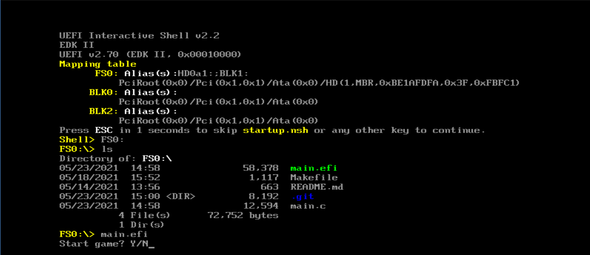
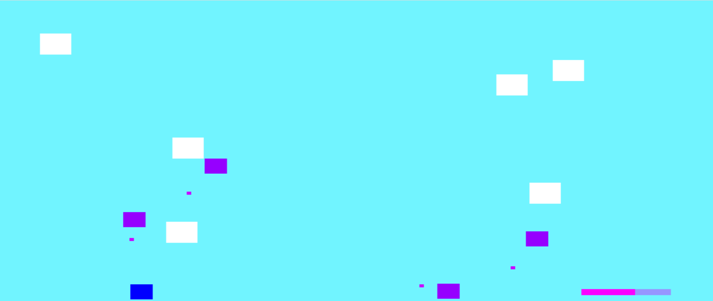
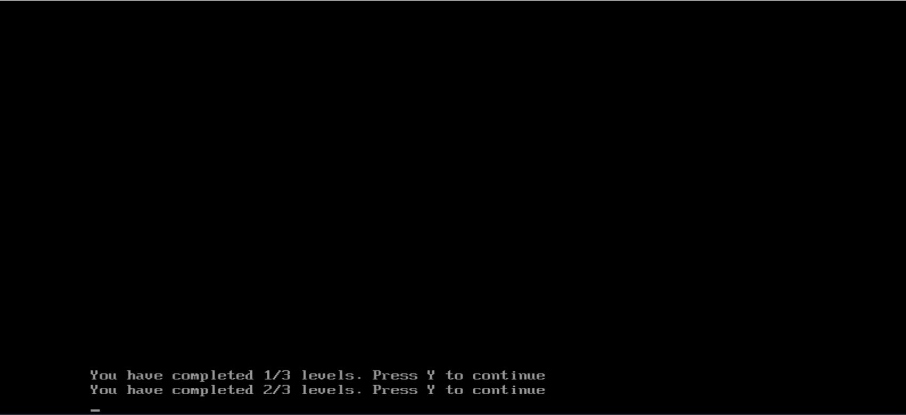
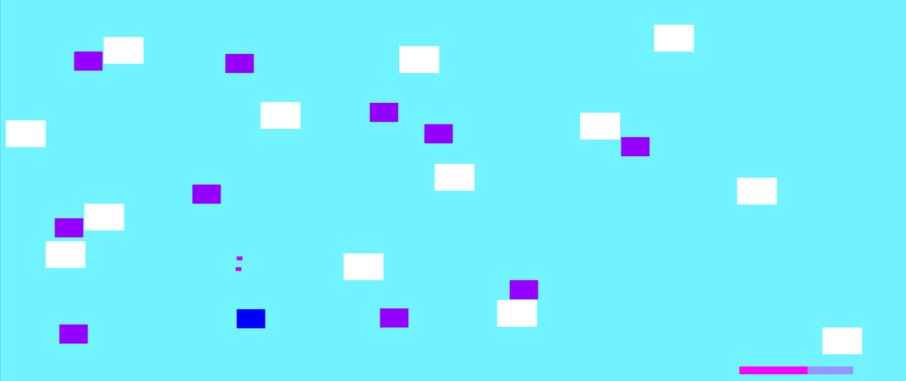
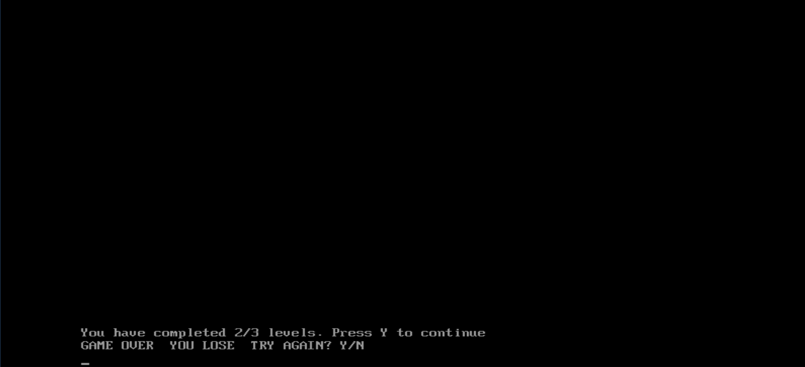
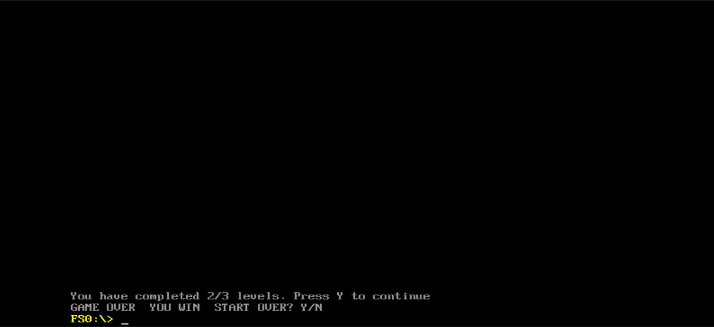

# Hack'n'Slash UEFI
## Description
A Hack'n'Slash UEFI bootloader game developed in C, using the GNU-EFI library and OVMF. The project is developed in Linux.  
The goal of the player is to reach and defeat all the enemies on contact, while avoiding to get hit by their bullets. 

## Examples
Nuclear Throne: https://www.youtube.com/watch?v=n3IvM0f2Lvw  
The Binding of Isaac: https://www.youtube.com/watch?v=Sr4LReuBfhw  
Restless Dungeon: https://www.youtube.com/watch?v=RQ9dRZHqwmM  

## Installation
### Set-up
**sudo apt-get install gnu-efi**  
**sudo apt-get install ovmf**  
**sudo apt-get install qemu-system-x86**  

mkdir hacknslash  
cd hacknslash  
cp /usr/share/ovmf/OVMF.fd bios.bin  
git clone https://gitlab.com/smp2021/332aa/hack-n-slash-uefi-bootloader.git  
### Compile
cd hack-n-slash-uefi-bootloader  
make
### Run 
cd hacknslash  
qemu-system-x86_64 -pflash bios.bin -hda fat:rw:hack-n-slash-uefi-bootloader -net none    
*How to run the game under QEMU*  
## Functionalities
- Player controlled on key input: **w/a/s/d**   
- Untargetable obstacles, randomly generated, conditioned by player's position  
- Enemies, randomly generated, conditioned by player's and obstacles' position  
- Melee player attack system which deletes the enemies in contact with the player on key input **m**  
- Timed enemies position change  
- Ranged enemies attack system which damages the player's life status  
- Timed fire rate  
- Obstacles collision system: blocking the player and the enemies and deleting the bullets  
- Three levels with ascending difficulty  
- Life status updated on-hit  
- Interactive GUI using Graphics Output Protocol and Simple Text Output Protocol    
*First round*  
*In-between rounds message*  
*Last round*  
*Defeat message*  
*Victory message*  
